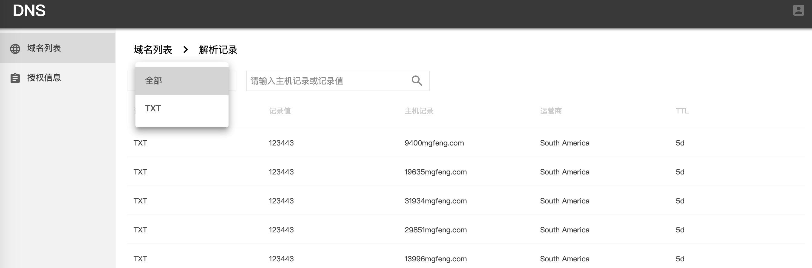

# NSBridge

[](https://godoc.org/github.com/solution9th/NSBridge)&nbsp;&nbsp;[](https://goreportcard.com/report/github.com/solution9th/NSBridge)

NSBridge 是一个桥梁服务，对上提供统一的 Name Server API 服务，对下封装 Bind、DNSPod、CloudXNS、OREdge 等 NS Provider，并集成图形化的 API 赋权、域名管理、日志审计、服务预警等能力。

## 当前支持的NS Provider

- OpenResty® Edge

## 当前支持的记录类型

- A
- CNAME
- TXT
- MX
- NS

## 系统截图

### 授权


### 域名



### 解析记录


## 安装

### 依赖的软件

| 软件 | 版本|
|:--:|:--:|
|Node.js|8.4.0 (及以上)|
|Golang|1.9 (及以上)|
|MySQL|5.6.35 (及以上)|
|Redis|4.0.1 (及以上)|

### 获取源码

```shell
$ go get github.com/solution9th/NSBridge
```


### 前端模块

在 `client/api/homeApi.js` 中配置后台的host地址，所有后台接口都在api文件夹中。

进入`NSBridge/website`目录，输入命令

```shell
# 如果安装失败，或速度慢，可尝试阿里的镜像
$ npm install --registry=https://registry.npm.taobao.org
```


### 后端依赖的库

NSBridge使用dep来管理依赖的包，请先安装dep, 执行以下命令即完成安装

```
go get -u github.com/golang/dep/cmd/dep
```

然后，在 **NSBridge** 项目目录下运行以下命令来安装依赖

```
dep ensure
```

## 配置文件

- 测试环境为 `config.dev.yml`
- 生产环境为 `config.production.yml`

## 证书相关

- 在 `apiweb/certs` 放idp的saml证书
- 使用`openssl`生成grpc证书到 `keys/grpc` 目录下

## oneapm 配置 (可不配置)

- 测试环境为 `buleware-agent.ini`
- 生产环境为 `blueware-agent.production.ini`

## 运行

### 运行前端项目
进入`NSBridge/website`目录，然后运行

```shell
$ npm run dev
```

### 运行后端项目
进入`NSBridge`目录，然后运行

快速运行
```shell
$ make build
$ ./ns_bridge
```
